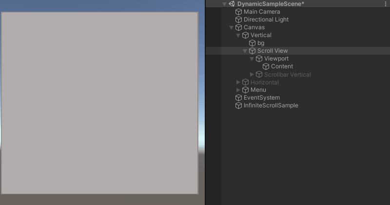
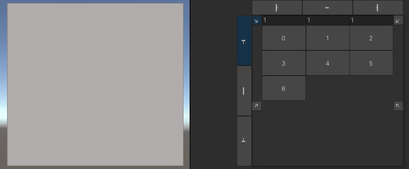
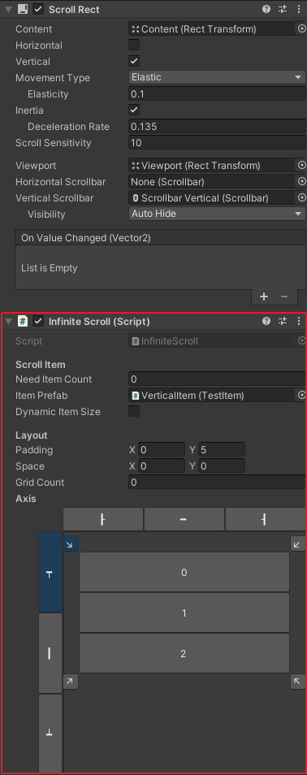
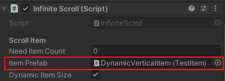
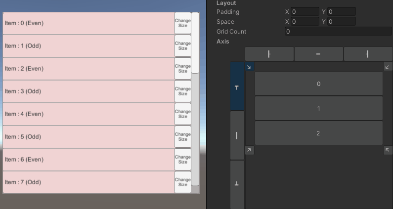
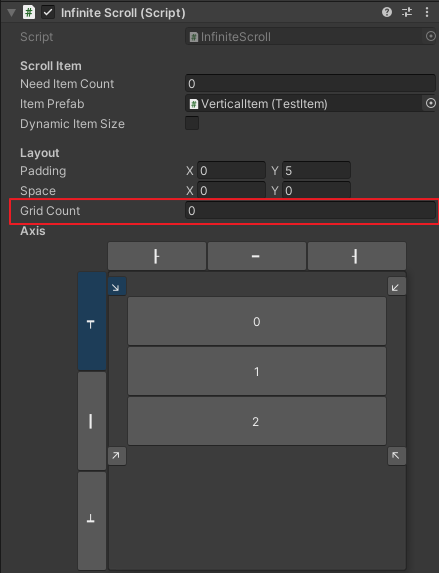
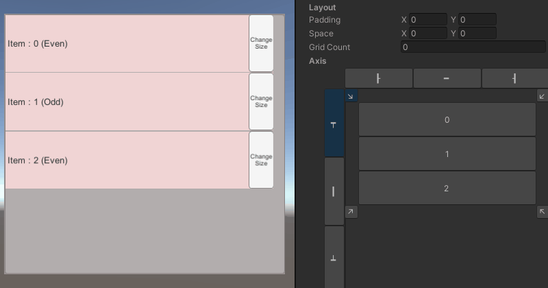
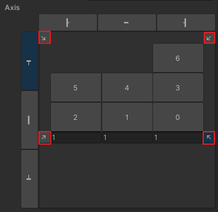

# Infinite Scroll

🌏 [한국어](README.md)

## 🚩 Table of Contents

* [Overview](#overview)
* [How to use](#how-to-use)
* [API](#-api)
* [Sample](#-sample)

## Overview

ScrollRect(Scroll View) creates scrollItems to fit in content and allows them to be reusable.

### Reusing ScrollItem
* Reusing scrollItems conserves memory and enhances performance.



* InfiniteScroll creates content elements using user-inserted InfiniteScrollData inherited classes.
    * Use 'InfiniteScroll.InsertData()'
* In the Prefab intended to be used as content elements, the InfiniteScrollItem inherited class must be attached before use.
    * Implement the 'InfiniteScrollItem.UpdateData()' method.

### Scroll Management
* Can adjust the reference point and direction according to the purpose of using the scroll.


## How to use

### Configuration

* Add the Infinite Scroll component to the object with the scroll rectangle area (ScrollRect/Scroll View) attached.
* Attach a prefab with a class that inherits InfiniteScrollItem to the Item Prefab.


### Apply scroll data
* To apply scroll data, Need to implement the UpdateData method within a class that inherits from the InfiniteScrollItem class. This allows you to apply data to the content's data.
    ```
    public override void UpdateData(InfiniteScrollData scrollData)
    {
        base.UpdateData(scrollData);

        // Apply data as InfiniteScrollData content
    }
    ```

### Adding ScrollItem
* Add a ScrollItem using the InsertData function with a data class that inherits from InfiniteScrollData.
* The added data is managed internally by the scroll and passed to UpdateData of InfiniteScrollItem to update the items.

```
public InfiniteScroll scroll;

class TestScrollData : InfiniteScrollData
{
}

void InsertData()
{
    TestScrollData data = new TestScrollData();

    scroll.InsertData(data);
}
```

### ScrollItem Filtering
Can filter the data managed within the scroll to control what is shown.
* Use the 'SetFilter' function to make scrollItems invisible.
* ScrollItems with a return value of false will be visible, while those with a return value of true will not be visible.

```
public InfiniteScroll scroll;

class TestScrollFilter : InfiniteScrollData
{
    public bool filter;
}

void Filter()
{
    scroll.SetFilter(TestFilter);
}

bool OnFilter(InfiniteScrollData data)
{
    if (data is TestScrollFilter testData)
    {
        return testData.filter;
    }

    return false;
}
```

#### Filtering Odd and Even


### ScrollItem Dynamic Resizing
* Enable the Dynamic Item Size option.
* InfiniteScrollItem inherited class
    * Use SetSize to change the size.
    * When the size is changed without using SetSize, the OnUpdateItemSize() function is called to reflect it on the scroll.

### Applying Grid to ScrollItems
* Can divide the items of the scroll into a grid for application.


#### Inspector
* Set the size to divide the Values ​​grid of Layout.
    * 
* Set the grid ratio with the ratio of the Element of Values.
    * Activated when Grid Count is 2 or more.
    * The UI position may change depending on the direction of the scrollItems.
    * 


### Applying Scroll Reference Point
* Can set the reference point of the scroll.
    * Horizontal (left, center, right)
    * Vertical (top, middle, bottom)


#### Inspector
* Can select buttons to indicate the direction for each reference point.


### Applying ScrollItem Direction
* Can set the direction in which scrollitems are aligned.


#### Inspector
* Can select buttons for each direction to set the direction.


### Scroll Events
Events called according to changes in the status of ScrollView.

You can register and utilize the callback function through the Inspector or AddListener.

#### Inspector


#### onChangeValue
The event that is called when the value of ScrollView is changed.
* (int)firstDataIndex
    * Index of the first data as seen in the scroll
* (int)lastDataIndex
    * Index of the last data seen in the scroll
* (bool)isStartLine
    * Whether the scroll is the starting point
* (bool)isEndLine
    * Whether the scroll is the last point
```cs
onChangeValue.AddListener(firstDataIndex, lastDataIndex, isStartLine, isEndLine =>
{
    // funtion
});
```

#### onChangeActiveItem
Event called when Scroll Item is visible or disappeared.
* (int)dataIndex
    * Index of changed scroll data
* (bool)active
    * Whether scroll items are enabled
```cs
onChangeActiveItem.AddListener(dataIndex, active =>
{
    // funtion
});
```

#### onStartLine
This event is called when the start point of ScrollView changes.
* (bool)isStartLine
    * Whether the scroll is the starting point
```cs
onStartLine.AddListener((bool)isStartLine =>
{
    // funtion
});
```

#### onEndLine
This event is called when the last point in ScrollView changes.
* (bool)isEndLine
    * Whether the scroll is the last point
```cs
onEndLine.AddListener((bool)isEndLine =>
{
    // funtion
});
```

## 🔨 API

Regarding how to use API, see Assets/GPM/UI/Sample/InfiniteScroll/Scripts/InfiniteScrollSample.cs.

### InsertData

Add data as the element of content.
* data : Data to be added
* insertIndex : Index where the addition is desired

```cs
public void InsertData(InfiniteScrollData data)
```
```cs
public void InsertData(InfiniteScrollData data, int insertIndex)
```
```cs
public void InsertData(InfiniteScrollData[] datas)
```
```cs
public void InsertData(InfiniteScrollData[] datas, int insertIndex)
```

### UpdateData

Update inserted data.

```cs
public void UpdateData(InfiniteScrollData data)
```

### UpdateAllData

Update all data.
* If immediately is true, the data will be updated immediately.

```cs
public void UpdateAllData(bool immediately = false)
```

### RemoveData

Delete inserted data.
* InfiniteScrollData : If there is managed data, it deletes that data.
* dataIndex : Deletes the data of the managed data.

```cs
public void RemoveData(InfiniteScrollData data)
```
```cs
public void RemoveData(int dataIndex)
```

### Clear

Delete all data.

```cs
public void Clear()
```

### MoveToFirstData

Move content to the first data.

```cs
public void MoveToFirstData()
```

### MoveToLastData

Move content to the last data.

```cs
public void MoveToLastData()
```

### IsMoveToLastData

Check if content has been moved to the last data.

```cs
public bool IsMoveToLastData()
```

### MoveTo

Move content to the specified data.

* itemIndex : Moves to the index of the filtered scrollItem.
* MoveToType : Determines where the data moves to. Options are Top, Center, and Bottom.
* time : Sets the time it takes to move. It moves instantly when set to 0.
* InfiniteScrollData : If there is managed data, it moves to that data.

```cs
public void MoveTo(int itemIndex, MoveToType moveToType, float time = 0)
```

```cs
public void MoveTo(InfiniteScrollData data, MoveToType moveToType, float time = 0)
```


### MoveToFromDataIndex

Moves the content to the index of the managed data.
* dataIndex :  Moves to the index of the managed data.
* MoveToType : Specifies where the data moves to. Options are Top, Center, and Bottom.
* time : Sets the duration of the movement. It moves instantly when set to 0.

```cs
public void MoveToFromDataIndex(int dataIndex, MoveToType moveToType, float time = 0)
```
### SetFilter

Selects the scrollItems to be displayed on the scroll.
* A boolean function is added to determine if the scrollItem is filtered.
* When it returns true, the scrollItem is filtered and not displayed; when it returns false, the scrollItem remains visible.
* When there's a complete refresh, calling SetFilter again will reapply the filtering.
* Adding null will result in no filtering.

```cs
public void SetFilter(Predicate<InfiniteScrollData> onFilter)
```

### SetScrollAxis
Sets the reference point of the scroll content.

```cs
public void SetScrollAxis(ScrollAxis axis)
```

### GetScrollAxis
Gets the reference point of the scroll content.

```cs
public ScrollAxis GetScrollAxis()
```

### SetPadding
Sets the padding of the scroll.

```cs
public void SetPadding(Vector2 padding)
```

### GetPadding
Retrieves the padding of the scroll.

```cs
public Vector2 GetPadding()
```

### SetSpace
Sets the spacing between scrollItems.

```cs
public void SetSpace(Vector2 space)
```

### GetSpace
Retrieves the spacing between scrollItems.

```cs
public Vector2 GetSpace()
```

### ResizeScrollView

The API is required to have Infinite Scroll deal with size changes when the size of ScrollView has been changed.

```cs
public void ResizeScrollView()
```

## 🐾 Sample

Assets/GPM/UI/Sample/InfiniteScroll


