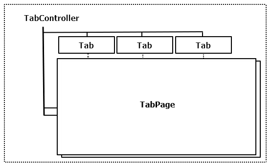
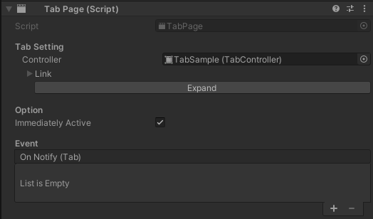
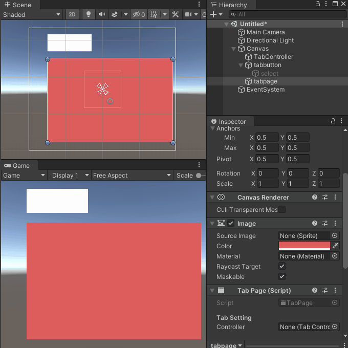
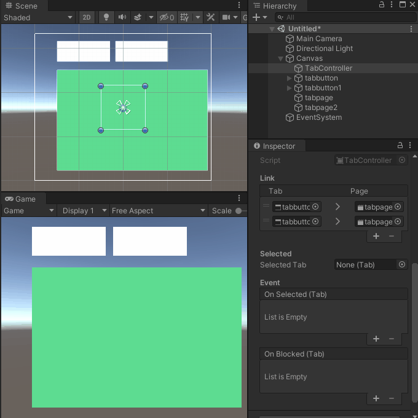
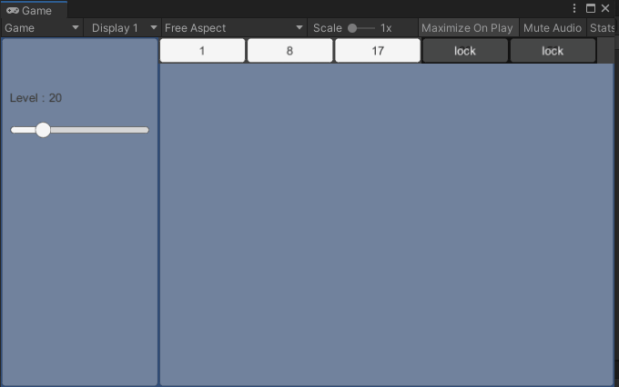
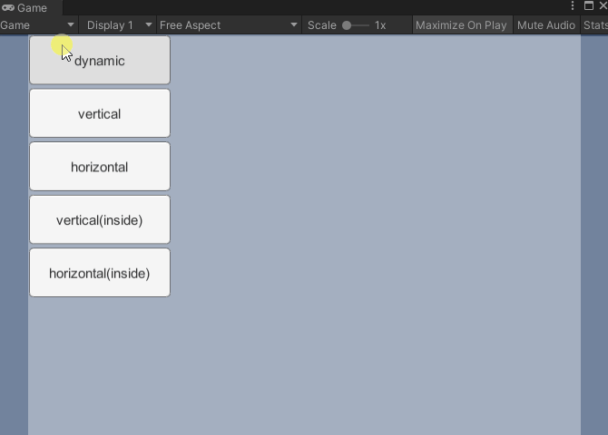

# Tab Control

🌏 [한국어](README.md)

## 🚩 Table of Contents

* [Overview](#overview)
    * [Component](#component)
    * [TabController](#tabcontroller)
    * [Tab](#tab)
    * [TabPage](#tabpage)
* [How to use](#how-to-use)
    * [Create a TabControl with ui](#create-a-tabcontrol-with-ui)
    * [Apply data to Tab](#apply-data-to-tab)
    * [Tab customization](#tab-customization)
* [API](#api)
    * [TabController](#tabcontroller-api)
    * [Tab, TabButton](#tab-tabbutton-api)
    * [TabPage](#tabpage-api)
* [Sample](#sample)

## Overview

The Tab Control component controls Tabs and TabPages that are frequently used in the UI.


### Component
Tab Control consists of three components.

1. TabController
    * Connect and control Tab and TabPage.
2. Tab
	* TabButton component is provided to easily use Tab as a button.
    * Can open the associated TabPage by selecting Tab.
    * Each Tab can only use one in the TabController.
    * Apply and use data to Tab.
3. TabPage
    * TabPages can be shared within the same TabController.
    * Updates the TabPage using the data passed from the selected Tab.

### TabController
TabController component controls Tab and TabPage


* Link
    * Connect Tab and TabPage.
* Selected
    * SelectedTab
        * Can set the initially selected tab.
* Event
    * OnSelectedTab(Tab)
        * Event when tab is selected
    * OnBlocked(Tab)
        * Event when Tab selection is blocked

### Tab
Tab component can set and get the state and data of the tab button.
Select Tab to open the associated TabPage.
Connect to TabController and use it.

* TabButton component is provided to easily use Tab as a button.
* When using the Tab component, should call Tab.OnClick() directly in the selection event.
	* ex): Connect Tab.OnClick() to ugui Button.OnClick() event.
* Each Tab can only use one TabController.
* Apply and use data to Tab.


#### Tab Setting

* Controller
    * TabController connected to Tab
    * LinkedPage
        * Linked TabPage that opens when selected.
    * Link
        * Can check and modify the TabController connected to it.
        * The Tab currently being edited is activated.
            

#### State

* Block Tab
    * Check if Tab is blocked
    * When blocked, there is no selection.
    * On selection, receive OnBlocked event.
* Selected
    * Check if Tab is selected
    * On selection, receive the OnSelected event.

#### Event

* OnUpdateData(ITabData)
    * Event that occurs when Tab data is updated
    `Tip : Can set the tab button according to the tab data change`
* OnChangeValue(bool)
    * Event triggered when selection is changed
    `Tip : Set it to Editor And Runtime, you can easily check the tab change according to the selection in the editor.`
* OnChangeBlock(bool)
    * Event that occurs when the lock status is changed
    `Tip : Set it to Editor And Runtime, you can easily check the tab change depending on whether it is blocked or not in the editor.`
* OnSelected(Tab)
    * Event triggered when Tab is selected
* OnBlocked(Tab)
    * Event triggered when a blocked tab is selected

### TabPage

TabPage receives the event of the tab being selected.

* Can share TabPages within the same TabController.
* Updates the TabPage using the data passed from the selected Tab.



#### Tab Setting

* Controller
    * TabController connected to Tab
    * Link
        * Can check and modify the TabController connected to it.
        * The currently edited TabPage is activated.
        

#### Option

* Immediately Active
    * Whether TabPage is activated immediately when Tab is selected.
    `Tip : Can turn it off and activate it directly after other actions.`

#### Event

* OnNotify(Tab)
    * Event notified to all connected TabPages when a tab is selected
    `Tip : Can update only the selected page by using IsSelected() of Tab`.
    `Tip : Can update the UI with data received from Tab's GetData().`

---

## How to use

### Create a Tab Control with ui

Create a new TabControl by connecting Tabs and TabPages to the TabController.

1. Add TabController component to use TabControl.
    * 
2. The pressed button adds a TabButton component.
    * 
3. The object that opens adds a TabPage component.
    * 
4. Connect Tab and TabPage to TabController. There are several ways.
    * Connect TabController from TabButton and connect TabPage to LinkedPage or Link
    * Connect TabButton and TabPage in TabController
    * 
5. Execute it to check the operation of the Tab Control.
    * 

* See TabSample

### Apply data to Tab

Set and use data in Tab.

* Define a data class by inheriting the ITabData interface
* Apply data via SetData in Tab
* Using data via GetData in Tab


1. Define a class to use as data.
Inherits the ITabData interface.

```
public class SampleTabData : ITabData
{
    public string text;
}
```

2. Set a class that inherits the ITabData interface for Tab.
Can also set the tab directly
Can also find a tab via GetTab in TabController.

```
public TabController tabController;
public Tab tab;
void SampleFunc()
{
    // Can also find a tab via GetTab in TabController.
    // tab = tabController.GetTab(0);

    SampleTabData data = new SampleTabData();
    data.text = "sampleText";

    // Apply data to Tab
    tab.SetData(data);
}
```
3. In Tab, Can receive data through the onUpdateData event and update the UI.
onUpdateData is an event triggered when SetData is called from Tab.

```
public Text buttonText;

// Define the data setting function.
public void DataSetting(ITabData updateData)
{
    // Cast the ITabData passed in and use it.
    SampleTabData data = (SampleTabData)updateData;

    // Tab UI update
    buttonText.text = data.text;
}
```

* Can add it as an AddListener to the tab's onUpdateData.

```
Tab tab;
void SampleFunc()
{
    tab.onUpdateData.AddListener(DataSetting);
}
```

* Can also be added in the tab's inspector.


4. In TabPage, Can update UI through onNotify event.
* The onNotify event is an event that notifies all connected TabPages when a Tab is selected.
* Can update only the selected page by using IsSelected() of Tab.
* Can update the UI with data received from Tab's GetData().

```
public Text pageText;

// Define the data setting function.
public void PageDataSetting(Tab tab)
{
    // The onNotify event is an event that notifies all connected TabPages
    // Updates only the selected TabPage.
    if (tab.IsSelected() == true)
    {
        // ITabData passed through GetData is cast and used.
        SampleTabData data = (SampleTabData)tab.GetData();

        // TabPage UI update
        pageText.text = data.text;
    }
}
```

* Can add it with the tab's onNotify AddListener.

```
TabPage tabPage;
void SampleFunc()
{
    tabPage.onNotify.AddListener(PageDataSetting);
}
```

* Can also add it in TabPage's inspector.


* See TabDataSettingSample

### Tab customization

Tabs are available in many forms.

1. Create TabButton component
    * Reacts based on ugui's raycast Target.
2. Create Tab component
    * Can use it by creating a ugui Button and attaching Tab.OnClick() to the OnClick() event.
3. Create CustomTab
    * Can inherit and use Tab or TabButton.
    * Can customize it freely by overriding the event function.
        * public virtual void OnUpdateData(ITabData data)
        * public virtual void OnChangeValue(bool selected)
        * public virtual void OnSelected()
        * public virtual void OnBlocked()

```
public class CustomTabSample : Tab
{
    public override void OnUpdateData(ITabData data)
    {
        base.OnUpdateData(data);

        // funtion
    }

    public override void OnChangeValue(bool active)
    {
        base.OnChangeValue(active);

        // funtion
    }
}
```

---

## 🔨 API

How to use the API is in Assets/GPM/UI/Sample/TabControl/Scripts/
Please refer to the sample code.

### TabController API

#### GetSelectedIndex

Can get the index of selected tabs.

``` cs
public int GetSelectedIndex()
```

#### GetSelectedTab

Can get the selected Tab.

``` cs
public Tab GetSelectedTab()
```

#### GetSelectedPage

Can get the selected TabPage.

``` cs
public TabPage GetSelectedPage()
```

#### GetTabCount

Can get the number of tabs

``` cs
public int GetTabCount()
```

#### GetTab

Can get tabs from the index.

``` cs
public Tab GetTab(int index)
```

#### GetTabIndex

Can get the index of Tab.

``` cs
public int GetTabIndex(Tab tab)
```

#### Contain
Can get if the Tab already contains it.

``` cs
public bool Contain(Tab tab)
```

#### AddTab

Can add a Tabs.

``` cs
public void AddTab(Tab tab, TabPage page)
```

#### SelectFirstTab

Select the first tab.

``` cs
public void SelectFirstTab()
```

#### Select

Select the tab of the index.

``` cs
public void Select(int index = 0)
```

#### Select

Select the Tab

``` cs
public void Select(Tab selectTab)
```

#### onSelected

Event is called when a tab is selected.

* (Tab)tab
    * Selected Tab

``` cs
onSelected.AddListener((Tab)tab =>
{
    // funtion
});
```

#### onBlocked

Event is called when Tab is selected but blocked.

* (Tab)tab
    * Blocked Tab

``` cs
onBlocked.AddListener((Tab)tab  =>
{
    // funtion
});
```

- - -

### Tab, TabButton API

#### GetData

Can get the data.

``` cs
public ITabData GetData()
```

#### SetData

Can set the data.

``` cs
public void SetData(ITabData data, bool notify = true)
```

#### GetLinkedPage

 Can get TabPage connected to Tab.

``` cs
public TabPage GetLinkedPage()
```

#### SetLinkPage

Can set a TabPage connected to a Tab.

``` cs
public void SetLinkPage(TabPage page)
```

#### OnClick

Can use click event. Can control the click with another object.

``` cs
public virtual void OnClick()
```

#### IsBlock

Can check if the select is the Tab blocking.

``` cs
public bool IsBlock()
```

#### SetBlockTab

Can set if Tab blocks selection.

``` cs
public void SetBlockTab(bool value)
```

#### IsSelected

Can check whether the Tab is selected.

``` cs
public bool IsSelected()
```

#### Select

Select the Tab

``` cs
public void Select()
```

#### NotifyPage

Notifies the event of the connected TabPage.

``` cs
public void NotifyPage()
```

#### onUpdateData

Event is called when the tab data is changed.
Called when using SetData.

* (ITabData)tabData
    * Tab data applied to Tab

``` cs
onUpdateData.AddListener((ITabData)tabData =>
{
    // funtion
});
```

#### onChangeValue

Event is called when the Tab's selected state changes.

* (bool)selected
    * whether Tab is selected

``` cs
onChangeValue.AddListener((bool)selected =>
{
    // funtion
});
```

#### onChangeBlock

Event is called when the Tab's blocking state changes.

* (bool)blockTab
    * Whether Tab is a blocking tab

``` cs
onChangeBlock.AddListener((bool)blockTab =>
{
    // funtion
});
```

#### onSelected

Event is called when a tab is selected.

* (Tab)tab
    * Selected Tab

``` cs
onSelected.AddListener((Tab)tab =>
{
    // funtion
});
```

#### onBlocked

Event is called when Tab is selected but blocked.

* (Tab)tab
    * Blocked Tab

``` cs
onBlocked.AddListener((Tab)tab  =>
{
    // funtion
});
```

- - -

### TabPage API

#### onNotify
Event notifies all associated TabPages when a tab is selected.

* (Tab)tab
    * Linked tap

``` cs
onNotify.AddListener((Tab)tab =>
{
    // The onNotify event is an event that notifies all connected TabPages
    // Updates only the selected TabPage.
    if (tab.IsSelected() == true)
    {
        // Get the data of the linked tab.
        ITabData tabData = tab.GetData();
	
        // Updating the TabPage UI with tabData
    }
});
```

---

## 🐾 Sample

### TabSample

Assets/GPM/UI/Sample/TabControl/Scene/TabSample.scene
Basic Tab Control sample.


### TabDataSettingSample

Assets/GPM/UI/Sample/TabControl/Scene/TabDataSettingSample.scene

Sample to set and apply Data in Tab.

* Enter level data in each Tab and control the level data..
* Can select a tab according to the set level.
* They share two types of TabPages. The UI is updated with the data from the selected tab.
* Can see how to use it when Tab is blocked when data is changed.
* Can know how to use when data is changed or when a tab is blocked.



### DynamicTabSample

Assets/GPM/UI/Sample/TabControl/Scene/DynamicTabSample.scene

Sample adds and deletes Tab data in real time.

* Add and manage tabs dynamically by copying the Tab prefab.
* Learn how to create tabs and control components with code.


### ShopTypeTabSample

Assets/GPM/UI/Sample/TabControl/Scene/ShopTypeTabSample.scene

Sample consisting of several shop UI types.
* dynamic
    * Shop type UI sample composed of double tabs.
* vertical
    * vertical shop type UI sample.
* horizontal
    * vertical shop type UI sample.
* vertical(inside)
    * vertical store type UI sample organized in groups.
* horizontal(inside)
    * horizontal store type UI sample organized in groups.
  


